# 官方脚手架
```javascript
npx create-react-app my-app
```
# useLayoutEffect
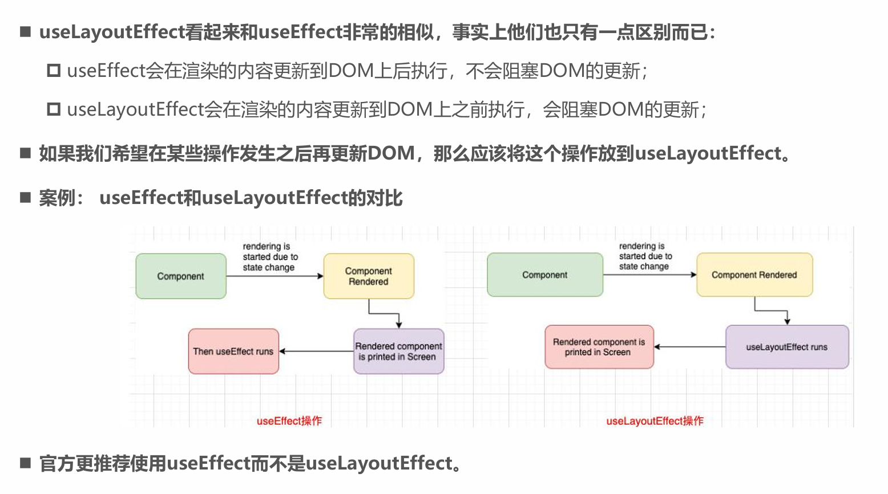
# useEffect 场景
## 1、每次渲染后都执行
```js
useEffect(() =>
{
// 每次组件渲染后都会执行
console.log('组件已渲染或更新');
});
```
## 2、仅在组件挂载时执行
```js
useEffect(() =>
{
// 只在组件挂载时执行一次
console.log('组件已挂载');
return () =>
{
// 清理函数，在组件卸载时执行
console.log('组件即将卸载');
};
}, []);
// 空依赖数组
```
## 3、依赖特定值变化时执行
```js
useEffect(() =>
{
// 当 count 或 name 变化时执行
console.log(`Count: ${count
}, Name: ${name
}`);
return () =>
{
// 清理上一次的 effect
console.log('清理上一次的 effect');
};
}, [count, name]);
// 依赖数组
```
## 4.多个useEffect
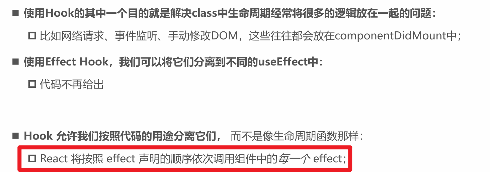
# classnames 库结合css模块使用
```
import React from 'react';
import classNames from 'classnames';
import styles from './Button.module.css';

const Button = ({ primary, size }) => {
  const buttonClass = classNames(styles.btn, {
    [styles.primary]: primary,
    [styles.large]: size === 'large',
    [styles.small]: size === 'small',
  });

  return (
    <button className={buttonClass}>
      Button
    </button>
  );
};

export default Button;
```
# classnames 库结合styled-components使用
```
import styled from 'styled-components';
import classNames from 'classnames';

const StyledButton = styled.button`
  &.btn-primary {
    background-color: blue;
  }
  &.btn-large {
    font-size: 1.5em;
  }
`;

const Button = ({ primary, size }) => {
  const buttonClass = classNames('btn', {
    'btn-primary': primary,
    'btn-large': size === 'large',
  });

  return (
    <StyledButton className={buttonClass}>
      Button
    </StyledButton>
  );
};

export default Button;
```
# 关于redux中useSelector的性能优化
## useSelector说明
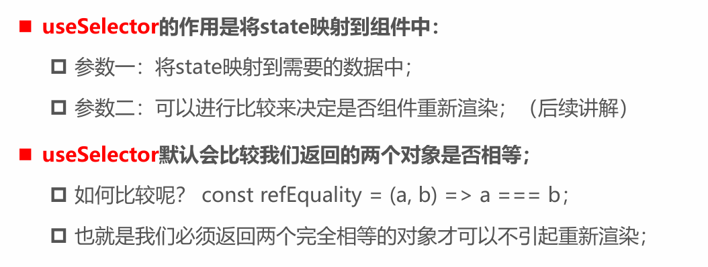
## 使用浅比较进行优化
```js
// ❌ 错误：每次state变化都触发渲染
const user = useSelector(state => state.user);

// ✅ 正确：仅当user变化时渲染
const user = useSelector(state => state.user, shallowEqual);

```
## 按字段进行精确选择
```js
// 仅当name变化时重新渲染
const userName = useSelector(state => state.user.name);

```
## 创建记忆化选择器
```js
import { createSelector } from '@reduxjs/toolkit';

const selectUser = state => state.user;
const selectTheme = state => state.theme;

// 创建记忆化选择器
const selectUserAndTheme = createSelector(
  [selectUser, selectTheme],
  (user, theme) => ({ user, theme })
);

// 组件中使用
const { user, theme } = useSelector(selectUserAndTheme);

```
# react-thunks与react-sagas
## 1、react-thunks
react-thunks是redux官方推荐的处理异步操作的中间件，它允许你在action creator中编写异步逻辑。
## 2、react-sagas
react-sagas是一个用于管理异步操作的库，它基于generator函数，提供了更强大的异步流程控制能力。

# 状态管理方式
1.组件中自己的state管理
2.Context数据的共享状态
3.Redux管理应用状态
# 项目中推荐的state管理方案
```
1.UI相关的组件内部可以维护的状态，在组件内部自己来维护；
2.大部分需要共享的状态，都交给redux来管理和维护；
3.从服务器请求的数据（包括请求的操作），交给redux来维护；
```
# 常见术语
## 高阶组件
例如：withRouter组件
高阶组件（HOC）是一种React模式，它是一个函数，接受一个组件作为参数，并返回一个新的组件。HOC可以用于在不修改原始组件代码的情况下，添加额外的功能或行为。

## 高阶函数
高阶函数是指接受一个或多个函数作为参数，或者返回一个函数作为结果的函数。在JavaScript中，函数是一等公民，因此可以将函数作为参数传递，也可以将函数作为返回值。

# useImperativeHandle
通过useImperativeHandle可以限制子组件暴露给父组件的方法
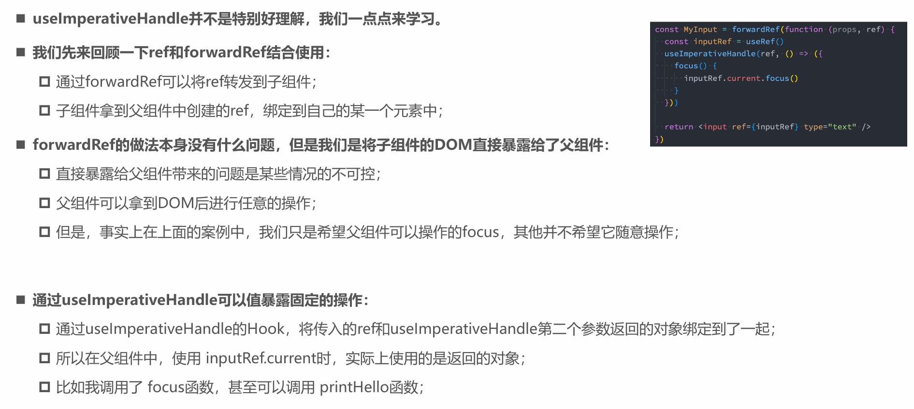
# 路由篇
## 安装依赖
```
单纯做web端的开发：npm i react-router-dom
涉及react-native的开发：npm i react-router
```
## 路由模式

## NavLink使用

## 嵌套路由

Outlet组件也是属于react-router-dom的，它用于在父路由中渲染子路由的内容。

### 示例代码
```
<Route path="/products" element={<Products />}>
  <Route path=":productId" element={<ProductDetails />} />
  <Route path="new" element={<NewProduct />} />
</Route>

```
在这个例子中，/products是父路由，当用户访问/products路径时，会渲染Products组件。在Products组件中，又定义了两个子路由：:productId和new。当用户访问/products/123时，会在Products组件的内部渲染ProductDetails组件，并将123作为:productId参数传递给ProductDetails组件；当用户访问/products/new时，会渲染NewProduct组件。
# 路由优先级
在react-router-dom中，路由优先级是一个非常重要的概念，它决定了在多个路由规则匹配时，哪个路由会被优先选中。理解路由优先级规则，可以帮助我们避免路由匹配冲突，确保应用的路由功能正常运行。
路由优先级的规则如下：
## 1.具体路径优先于动态路径：如果有一个具体路径的路由和一个动态路径的路由都匹配当前 URL，那么具体路径的路由会被优先匹配。例如，在下面的路由配置中：
```
<Route path="/products/new" element={<NewProduct />} />
<Route path="/products/:productId" element={<ProductDetails />} />
```
当用户访问/products/new时，会匹配到/products/new这个具体路径的路由，而不会匹配到/products/:productId这个动态路径的路由。因为/products/new是一个确切的路径，它比动态路径更具体，所以具有更高的优先级。
## 2.先定义的路由优先匹配：在<Routes>组件中，路由是按照定义的顺序进行匹配的。先定义的路由会先被检查，如果匹配成功，就不会再继续检查后面的路由。所以，我们要确保将常用的、具体的路由放在前面定义，以提高路由匹配的效率。例如：
```
<Route path="/about" element={<About />} />
<Route path="/" element={<Home />} />
```
# 路由参数传递方式
## 动态路由参数
定义动态路由
```
import { BrowserRouter as Router, Routes, Route } from'react-router-dom';
import UserProfile from './components/UserProfile';
function App() {
  return (
    <Router>
      <Routes>
        <Route path="/user/:id" element={<UserProfile />} />
      </Routes>
    </Router>
  );
}

```
目标组件,获取路由参数
```
import { useParams } from'react-router-dom';
const UserProfile = () => {
  const { id } = useParams();
  return (
    <div>
      <h1>用户详情</h1>
      <p>用户ID：{id}</p>
    </div>
  );
};
export default UserProfile;

```
## search传递参数

# 修改查询参数示例代码（覆盖旧的）
```
import { useSearchParams } from 'react-router-dom';
 
function MyComponent() {
  // 获取当前的查询参数
  const [searchParams, setSearchParams] = useSearchParams();
 
  // 获取特定查询参数值
  const id = searchParams.get('id');
  const name = searchParams.get('name');
 
  // 修改查询参数
  const updateParams = () => {
    setSearchParams({ id: '456', name: 'John' });
  };
 
  return (
    <div>
      <p>Current ID: {id}</p>
      <p>Current Name: {name}</p>
      <button onClick={updateParams}>Update Params</button>
    </div>
  );
}
```
# 修改查询参数示例代码（修改某个字段，保留其他字段）
```
setSearchParams(prev => {
  // 保留现有参数，修改某个字段
  prev.set('id', '456');
  return prev;
});
```
# 路由跳转方式
## 组件式路由跳转

## API路由跳转
### 类组件
实现一个withRouter高阶组件对类组件进行增强

### 函数式组件
直接调用useNavigate(新版)，useHistory（旧版，当前环境，我们用的最新的，这个知道就行）即可
```
const navigate = useNavigate();
navigate('/new-path'); // 跳转到指定路径
navigate(-1); // 跳转到上一个历史记录（类似浏览器的返回按钮）
navigate(`/profile/${userId}`); // 跳转到具体用户的个人页面
navigate('/new-path', { replace: true }); // 跳转，并替换当前的历史记录
//你还可以通过 state 传递一些状态数据，在导航后可以通过 location.state 访问这些数据。
navigate('/dashboard', { state: { from: 'login' } });
```
# useLocation 的使用
useLocation是react-router-dom提供的一个钩子函数，用于获取当前路由的location对象。
## 主要特性：
返回位置对象： useLocation 返回一个位置对象 (location)，包含以下几个主要属性：
pathname: 当前 URL 的路径部分（例如：/home）。
search: 查询字符串（例如：?id=123&name=abc）。
hash: 哈希值（例如：#section1）。
state: 传递的状态对象，通常用于在页面间传递一些非 URL 参数的数据。
## 用途：
在 React 应用中动态地根据当前路径或查询参数更新 UI。
实现路由相关的逻辑，比如基于 URL 路径变化显示不同的内容。

## 动态更新
useLocation 会随着浏览器的 URL 变化自动更新。如果你想监听路由变化，可以依赖 location 对象的变化来触发重新渲染。

## 示例

```
import { useLocation } from 'react-router-dom';
 
function MyComponent() {
  const location = useLocation();
 
  return (
    <div>
      <p>Current Path: {location.pathname}</p>
      <p>Query String: {location.search}</p>
      <p>Hash: {location.hash}</p>
    </div>
  );
}
```
# 性能优化：路由懒加载-提升用户体验
性能优化是 React 应用开发中至关重要的一环，它直接影响着用户体验。React.lazy 和路由级懒加载是两种常用的性能优化技术，它们可以让我们的应用加载速度更快，运行更加流畅。
React.lazy 可以实现组件的懒加载，它会在组件需要渲染时才加载组件的代码，而不是在应用启动时就加载所有组件的代码。
```
import React, { lazy, Suspense } from'react';
import { BrowserRouter as Router, Routes, Route } from'react-router-dom';
const Home = lazy(() => import('./pages/Home'));
const About = lazy(() => import('./pages/About'));
function App() {
  return (
    <Router>
      <Suspense fallback={<div>Loading...</div>}>
        <Routes>
          <Route path="/" element={<Home />} />
          <Route path="/about" element={<About />} />
        </Routes>
      </Suspense>
    </Router>
  );
}
export default App;

```
# 参数处理：确保数据准确性
在 React 应用中，参数处理是一个不可忽视的环节，它直接关系到数据的准确性和应用的稳定性。使用 TypeScript 可以帮助我们更好地定义参数类型，从而提高代码的可读性和可维护性。
例如，在一个接收用户 ID 的组件中，我们可以使用 TypeScript 来定义参数类型：
```
import { useParams } from'react-router-dom';
interface UserParams {
  id: string;
}
const UserProfile = () => {
  const { id } = useParams<UserParams>();
  return (
    <div>
      <h1>用户资料页面</h1>
      <p>用户ID为：{id}</p>
    </div>
  );
};
export default UserProfile;

```
在这个例子中，我们使用interface定义了一个UserParams接口，它包含一个id属性，类型为string。然后在useParams钩子函数中传入UserParams，这样 TypeScript 就会对id参数进行类型检查，如果传入的参数类型不符合定义，就会在编译时提示错误，就像一个严格的老师，时刻检查你的作业是否正确。
添加参数验证也是非常重要的，它可以确保传入的参数符合我们的预期。我们可以使用一些验证库（如validator.js）来进行参数验证。例如，在一个接收邮箱地址的组件中，我们可以使用validator.js来验证邮箱地址的格式：
```
import { useParams } from'react-router-dom';
import { isEmail } from 'validator';
const EmailComponent = () => {
  const { email } = useParams();
  if (!isEmail(email)) {
    return <div>邮箱地址格式不正确</div>;
  }
  return (
    <div>
      <p>邮箱地址为：{email}</p>
    </div>
  );
};
export default EmailComponent;

```
在这个例子中，我们使用isEmail函数来验证email参数是否是一个有效的邮箱地址。如果不是，就返回一个提示信息，避免因为参数错误而导致应用出现异常。同时，我们也要处理参数不存在的情况，确保应用的稳定性。比如，可以在组件中设置默认值，或者给出友好的提示信息，让用户知道发生了什么。
# 组件设计：提高代码复用性
组件设计是 React 开发中非常重要的一环，它直接影响着代码的复用性和可维护性。合理的组件设计可以让我们的代码像搭积木一样，通过组合不同的组件来构建出复杂的应用界面。
在 React 项目中，通常将页面级组件放在pages目录下，将可复用组件放在components目录下。页面级组件就像是一个房间，它负责展示整个页面的内容，并且可以包含多个可复用组件。而可复用组件则像是房间里的家具，它们可以在不同的页面中被重复使用。
例如，在一个电商应用中，商品列表页面是一个页面级组件，它可能包含商品卡片组件、分页组件等可复用组件。商品卡片组件可以展示商品的基本信息（如图片、名称、价格等），它可以在商品列表页面、商品详情页面等多个页面中被使用。分页组件则用于实现页面的分页功能，它也可以在多个需要分页的页面中被复用。
使用index.jsx作为默认导出是一种很好的习惯，它可以让我们在导入组件时更加简洁。比如，在components目录下有一个Button组件，我们可以在Button组件的目录下创建一个index.jsx文件，在这个文件中默认导出Button组件。这样，在其他组件中导入Button组件时，只需要使用import Button from './components/Button'即可，而不需要指定具体的文件名，就像你去商店买东西，只需要告诉店员商品的类别，而不需要说具体的品牌名一样方便。
# 路由组织：按功能模块划分
在 React 项目中，合理的路由组织就像是精心规划城市的布局，能让整个应用的结构更加清晰，易于维护。按功能模块组织路由是一种非常有效的方式，它就像把城市划分成不同的区域，每个区域都有自己独特的功能，比如商业区、住宅区、工业区等。
例如，在一个电商应用中，我们可以将与用户相关的路由（如登录、注册、个人资料等）放在一个模块中，将商品相关的路由（如商品列表、商品详情、购物车等）放在另一个模块中。这样，当我们需要修改或添加某个功能模块的路由时，只需要在对应的模块中进行操作，而不会影响到其他模块的路由。
使用嵌套路由可以进一步减少重复代码，提高代码的复用性。比如，在商品模块中，商品详情页面可能包含多个子页面（如商品描述、评论、相关推荐等），我们可以使用嵌套路由将这些子页面的路由嵌套在商品详情页面的路由下面。这样，不仅可以减少路由配置的重复代码，还能使整个路由结构更加清晰，就像一个树形结构，每个节点都有自己的位置和功能。
## 组件方式
```
import { BrowserRouter as Router, Routes, Route } from'react-router-dom';
import UserLogin from './pages/User/Login';
import UserRegister from './pages/User/Register';
import UserProfile from './pages/User/Profile';
import ProductList from './pages/Product/List';
import ProductDetail from './pages/Product/Detail';
import ProductCart from './pages/Product/Cart';
function App() {
  return (
    <Router>
      <Routes>
        {/* 用户模块路由 */}
        <Route path="/user" element={<div>用户模块</div>}>
          <Route path="login" element={<UserLogin />} />
          <Route path="register" element={<UserRegister />} />
          <Route path="profile" element={<UserProfile />} />
        </Route>
        {/* 商品模块路由 */}
        <Route path="/product" element={<div>商品模块</div>}>
          <Route path="list" element={<ProductList />} />
          <Route path="detail/:productId" element={<ProductDetail />}>
            <Route path="description" element={<div>商品描述</div>} />
            <Route path="reviews" element={<div>商品评论</div>} />
            <Route path="related" element={<div>相关推荐</div>} />
          </Route>
          <Route path="cart" element={<ProductCart />} />
        </Route>
      </Routes>
    </Router>
  );
}
export default App;
```
## useRoutes方式
### 1.配置路由信息
创建 src/routers/index.js文件
```
//路由json组件

import Mainbox from '../views/mainbox';
import Login from '../views/login'
import Home from '../views/Home'

const routes = [{
    path: '/home',
    element: <Home />,
      //加children进行嵌套
    children:[
      {
        path:'news',
        element:<News/>
      },
      {
        path:'message',
        element:<Message/>
      }
    ]
  },
  {
    path: '/',
    //重定向
    element: <Navigate to='/home' />
  }]
export default routes
```
### 2.使用useRoutes构建路由
App.js
```
import './App.css';
import { useRoutes } from 'react-router-dom';
import routers from './routers/index';

function App() {
//使用 useRoutes
  const GetRoutes = () => useRoutes(routers);
  return (
    <div className="App">
      <GetRoutes></GetRoutes>
    </div>
  );
}
export default App;
```
或者也可以这样写
```
import './App.css';
import { useRoutes } from 'react-router-dom';
import routers from './routers/index';

function App() {
//使用 useRoutes
  const GetRoutes = useRoutes(routers);
  return (
    <div className="App">
      {GetRoutes}
    </div>
  );
}
export default App;
```
### 3.配置index.js入口文件
index.js
```
import React from 'react';
import ReactDOM from 'react-dom/client';
import { HashRouter } from "react-router-dom";
import './index.css';
import App from './App';
import reportWebVitals from './reportWebVitals';

const root = ReactDOM.createRoot(document.getElementById('root'));
root.render(
//使用hashrouter路径携带#号
    <HashRouter>
        <App />
    </HashRouter>
);

```
### 4.嵌套路由Outlet占位展示示例
```
import React  from 'react'
//Outlet是嵌套路由的占位符
import { NavLink,Navigate, Outlet } from 'react-router-dom'

export default function Home() {
  return (
    <div>
      <h1>我是Home内容</h1>
      <ul>
        //嵌套路由千万不要加/ 
        <NavLink to='news'>News</NavLink>
        <NavLink to='message'>Message</NavLink>
      </ul>
      //路由显示的位置就在这里
      <div>
        <Outlet/>
      </div>
    </div>
  )
}
```
# 路由守卫
## 实现登录验证
```
import { Navigate, useLocation } from 'react-router-dom';

function RequireAuth({ children }) {
  const { user } = useAuth(); // 假设有用户上下文
  const location = useLocation();

  if (!user) {
    return <Navigate to="/login" state={{ from: location }} replace />;
  }

  return children;
}

// 路由配置
<Route 
  path="/profile"
  element={
    <RequireAuth>
      <UserProfile />
    </RequireAuth>
  }
/>
```
## 权限细粒度控制
```
// 高阶守卫组件
function RequireRole({ children, allowedRoles }) {
  const { user } = useAuth();
  
  if (!user?.roles?.some(r => allowedRoles.includes(r))) {
    return <Navigate to="/unauthorized" replace />;
  }

  return children;
}

// 使用示例
<Route
  path="/admin"
  element={
    <RequireRole allowedRoles={['admin']}>
      <AdminPanel />
    </RequireRole>
  }
/>
```
# Hooks
对于一个新的项目，我们提倡使用函数式组件+Hooks进行开发，这样代码看起来就会非常的简洁
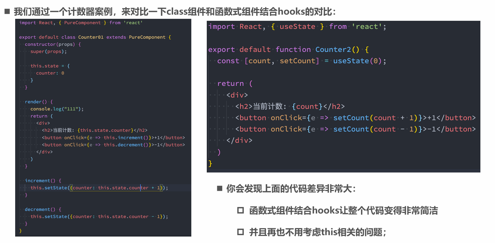
## 为什么叫useState 而不叫createState?
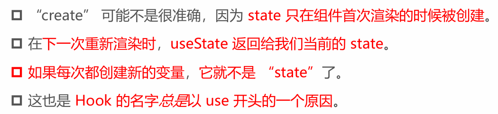
## Hooks调用原则
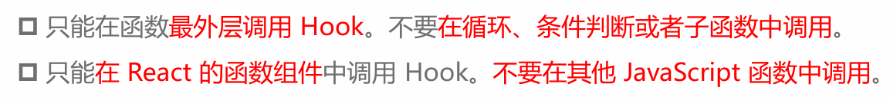
# 自定义hook
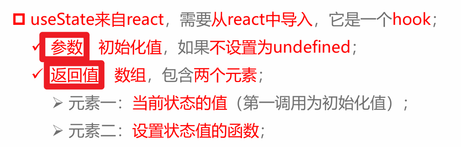
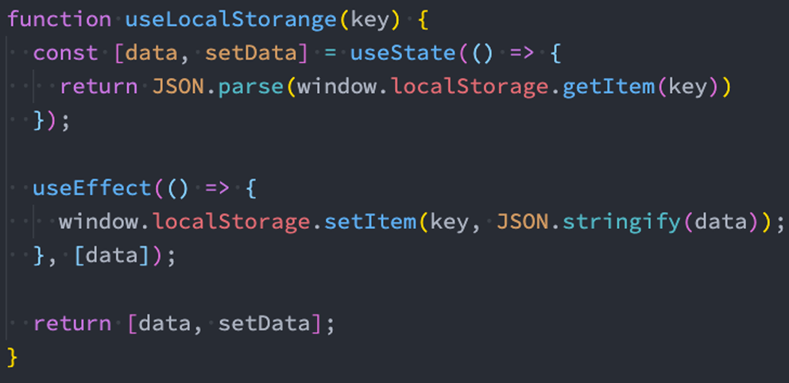
# useTransition
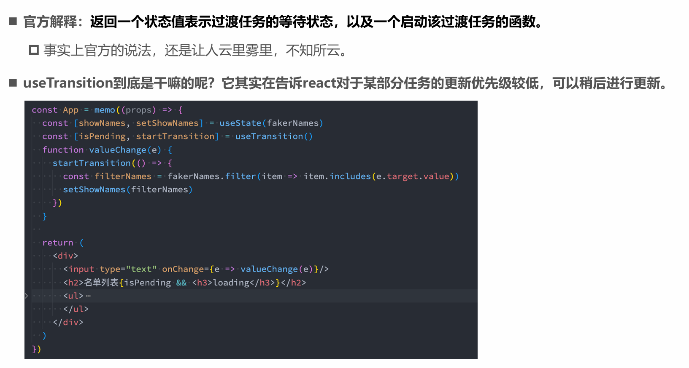
# useDeferredValue
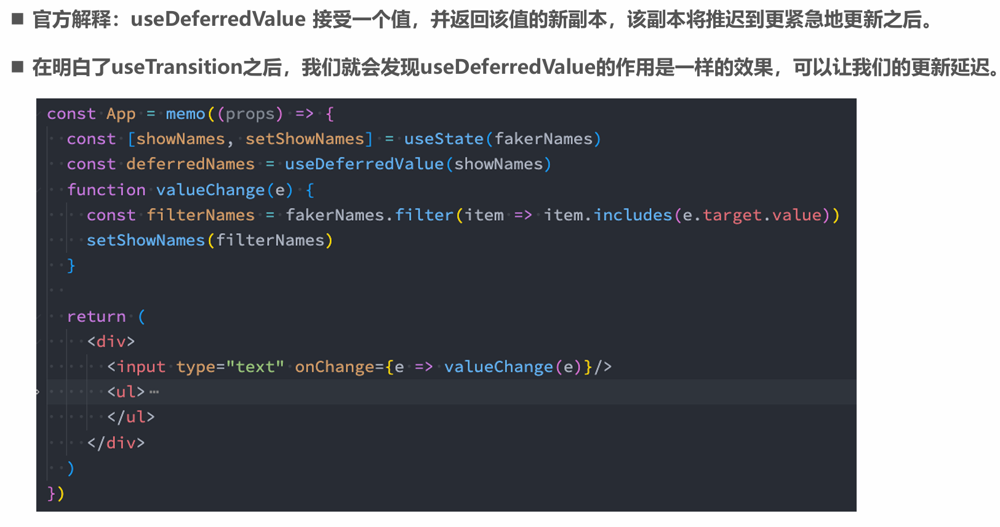
# SSR相关知识补充
## userId
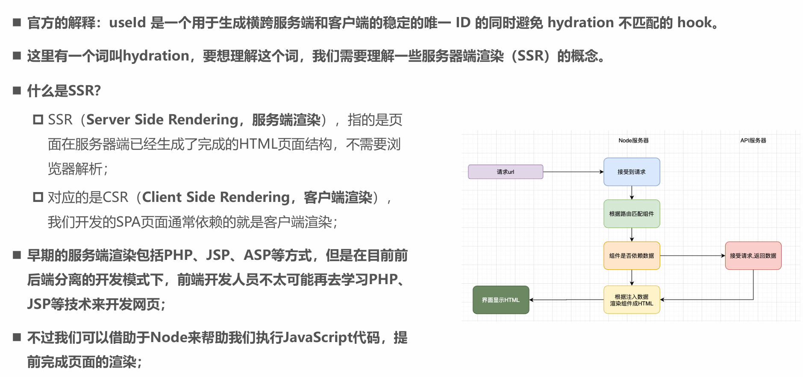
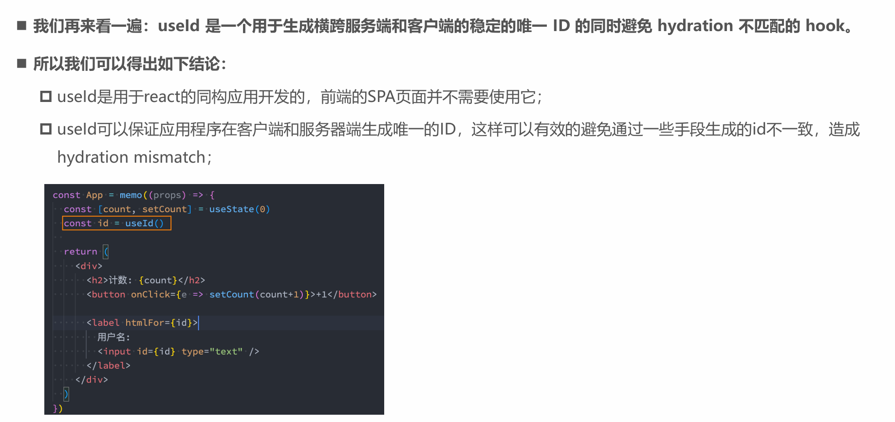
## SSR同构应用
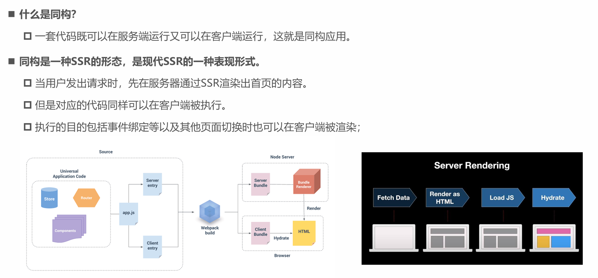
## Hydration
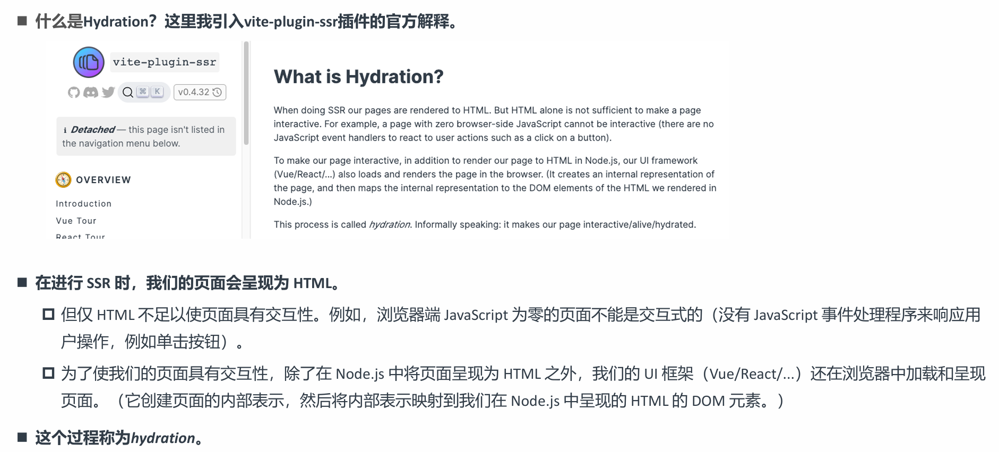